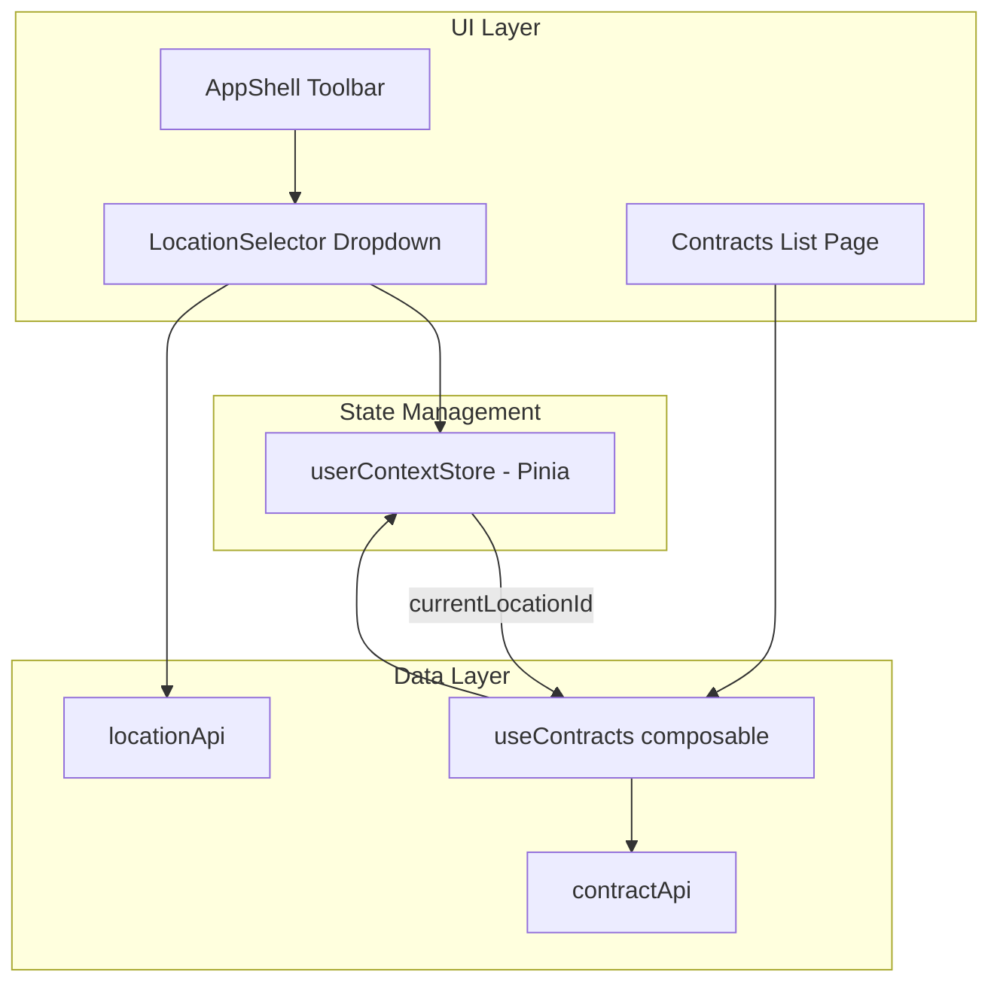

# Facts Alpha - Funeral Home ERP

A modern, scalable funeral home ERP system built with Vue 3, Vuetify 3, and Feature-Sliced Design architecture.

## Tech Stack

- **Framework**: Vue 3 (Composition API, `<script setup>`)
- **UI Library**: Vuetify 3 with MD3 Blueprint
- **Build Tool**: Vite 7
- **Monorepo**: Turborepo + pnpm workspaces
- **Data Fetching**: TanStack Query (Vue Query)
- **State Management**: Pinia (for global state)
- **Routing**: Vue Router (file-based with unplugin-vue-router)
- **Linting**: Oxlint (fast) + ESLint (Vue/Vuetify rules)
- **Formatting**: Prettier
- **TypeScript**: 5.9

## Project Structure

```
facts-alpha/
├── apps/
│   └── web/                    # Main Vue application
│       └── src/
│           ├── app/            # FSD: App layer (providers, global config)
│           ├── pages/          # FSD: Pages layer (file-based routing)
│           ├── widgets/        # FSD: Widgets layer (composite UI blocks)
│           ├── features/       # FSD: Features layer (user interactions)
│           ├── entities/       # FSD: Entities layer (business entities)
│           └── shared/         # FSD: Shared layer (utilities, API)
├── packages/
│   ├── ui/                     # @facts/ui - Design system components
│   │   └── src/
│   │       ├── components/     # Wrapper components (FButton, FCard, etc.)
│   │       ├── tokens/         # Design tokens (colors, spacing, typography)
│   │       └── composables/    # Form utilities (useDirtyForm, useConfirm, etc.)
│   └── utils/                  # @facts/utils - Shared utilities
│       └── src/
│           ├── formatters.ts   # Date, currency, number formatting
│           ├── object.ts       # lodash re-exports (cloneDeep, isEqual, etc.)
│           └── validation.ts   # Zod validators (currency, dates, strings)
└── turbo.json                  # Turborepo configuration
```

## Architecture: Feature-Sliced Design (FSD)

The application follows [Feature-Sliced Design](https://feature-sliced.design/) methodology:

### Layers (top to bottom, imports flow downward only)

1. **app/** - Application initialization, providers, global styles
2. **pages/** - Route-level components (file-based routing)
3. **widgets/** - Large composite UI blocks (AppShell, etc.)
4. **features/** - User interaction logic (CaseForm, etc.)
5. **entities/** - Business entities (Case, Tenant)
6. **shared/** - Reusable utilities, API clients, UI primitives

### Segments within each slice

- `ui/` - Vue components
- `model/` - Business logic, stores, types
- `api/` - API calls (if needed)
- `lib/` - Utility functions
- `config/` - Constants, configuration

## Design System (`@facts/ui`)

### Material Design 3 (MD3)

The app uses Vuetify's **MD3 Blueprint** which provides:

- M3-compliant shapes (corner radii)
- M3 typography scale
- M3 component behavior and defaults
- M3 motion/transitions

We only define **brand colors** to override the generic M3 palette:

```typescript
// packages/ui/src/tokens/colors.ts
export const brandColors = {
  primary: '#1660c4', // Deep indigo - professionalism
  secondary: '#67544e', // Warm brown - warmth/comfort
  error: '#ba1a1a',
  success: '#2e7d32',
  warning: '#f57c00',
  info: '#1976d2',
}
```

### Wrapper Components

Vuetify components with simplified APIs and consistent defaults:

| Component           | Wraps                      | Purpose                                                               |
| ------------------- | -------------------------- | --------------------------------------------------------------------- |
| `FButton`           | `v-btn`                    | Intent-based buttons (primary, secondary, tonal, danger, ghost, text) |
| `FTextField`        | `v-text-field`             | Text input with compact density                                       |
| `FTextarea`         | `v-textarea`               | Multiline text with auto-grow                                         |
| `FSelect`           | `v-select`                 | Dropdown with options array API                                       |
| `FCard`             | `v-card`                   | Cards with variant support (elevated, filled, outlined)               |
| `FDialog`           | `v-dialog`                 | Modal dialogs with preset widths                                      |
| `FConfirmDialog`    | `v-dialog`                 | Confirmation dialogs with Yes/No actions                              |
| `FDataTable`        | AG Grid                    | Data tables with slot-based cell rendering                            |
| `FCheckbox`         | `v-checkbox`               | Single checkbox                                                       |
| `FCheckboxGroup`    | `v-checkbox`               | Multiple checkboxes with options array                                |
| `FSwitch`           | `v-switch`                 | Toggle switch                                                         |
| `FRadioGroup`       | `v-radio-group`            | Radio buttons with options array                                      |
| `FDatePicker`       | `v-date-input`             | Date selection                                                        |
| `FTabs`             | `v-tabs`                   | Tab navigation with v-model binding                                   |
| `FLoader`           | `v-overlay`                | Loading overlay with spinner (contained to parent)                    |
| `FPageCard`         | `FCard` + `FLoader`        | Page/section wrapper with loading overlay                             |
| `FListCard`         | `FPageCard` + `FDataTable` | Data list wrapper with search, filters, loading                       |
| `FFormDialog`       | `v-dialog` + `FLoader`     | Form dialog with loading overlay and Save/Cancel                      |
| `FFullScreenDialog` | `v-dialog fullscreen`      | Full-screen dialog for complex ERP editing workflows                  |

### Form Composables

Reusable form utilities inspired by legacy FACTS app patterns:

| Composable          | Purpose                                                        |
| ------------------- | -------------------------------------------------------------- |
| `useFormModel`      | Live model state management with Zod validation                |
| `useDirtyForm`      | Snapshot-based dirty tracking for unsaved changes detection    |
| `useConfirm`        | Promise-based confirmation dialogs (pairs with FConfirmDialog) |
| `useFormSave`       | Standardized validate-then-save pattern with error handling    |
| `useListController` | Standardized list-to-edit workflow with dialog state           |

### Form State Architecture

Understanding how form state flows is crucial for working with our form patterns. We use a **separation of concerns** approach where source data, form state, and dirty tracking are distinct:

```
┌─────────────────────────────────────────────────────────────────────┐
│                         EditDialog.vue                              │
├─────────────────────────────────────────────────────────────────────┤
│                                                                     │
│  1. SOURCE DATA (read-only from server)                             │
│  ┌─────────────────────────────────────────────────────────────┐   │
│  │ const { contract } = useContract(contractId)                │   │
│  │                                                             │   │
│  │ What's saved in the database — NEVER mutated directly       │   │
│  └─────────────────────────────────────────────────────────────┘   │
│                              │                                      │
│                              ▼                                      │
│  2. INITIAL VALUES (transform for form)                             │
│  ┌─────────────────────────────────────────────────────────────┐   │
│  │ const { initialValues } = useContractForm(contractId)       │   │
│  │                                                             │   │
│  │ Transforms server data → form-friendly shape                │   │
│  │ (e.g., dates as strings, nested structures flattened)       │   │
│  └─────────────────────────────────────────────────────────────┘   │
│                              │                                      │
│                              ▼                                      │
│  3. FORM STATE (live, editable copy)                                │
│  ┌─────────────────────────────────────────────────────────────┐   │
│  │ const { model } = useFormModel(schema, initialValues)       │   │
│  │                                                             │   │
│  │ Reactive copy that user edits — mutated by v-model          │   │
│  └─────────────────────────────────────────────────────────────┘   │
│                              │                                      │
│                              ▼                                      │
│  4. DIRTY CHECK (compare model vs snapshot)                         │
│  ┌─────────────────────────────────────────────────────────────┐   │
│  │ const { canClose } = useDirtyForm(() => model.value)        │   │
│  │                                                             │   │
│  │ Snapshot taken on open → compared to current model          │   │
│  └─────────────────────────────────────────────────────────────┘   │
│                                                                     │
└─────────────────────────────────────────────────────────────────────┘
```

**Key Variables:**

| Variable        | Purpose                          | Mutated by User? |
| --------------- | -------------------------------- | ---------------- |
| `contract`      | Server data (TanStack Query)     | ❌ Never         |
| `initialValues` | Form-friendly version of data    | ❌ Never         |
| `model`         | User's working copy              | ✅ Yes           |
| `snapshot`      | Frozen copy for dirty comparison | ❌ Never         |

**Why This Pattern?**

1. **Rollback is easy** — just `reset(initialValues)`
2. **Dirty detection is reliable** — compare `model` vs `snapshot` with deep equality
3. **No accidental mutation** — `contract` is read-only from TanStack Query cache
4. **Clear mental model** — each variable has exactly one job

**Naming Convention:**

We use `model` (not `editModel`) because:

- Vue 3.4's `defineModel` establishes `model` as the convention
- In form context, it's unambiguous — the model IS for editing
- The parent already distinguishes: `contract` (source) vs `model` (form state)
- If explicit naming is needed, rename on destructure: `const { model: editModel } = useFormModel(...)`

**Example: Live Model Pattern**

```typescript
// Form state with Zod validation
const { model, errors, validate, getError, touch, reset } = useFormModel(
  contractSchema,
  () => getDefaultValues()
)

// Dirty tracking on the model
const { takeSnapshot, canClose } = useDirtyForm(() => model.value)

// Snapshot when dialog opens
watch(dialogOpen, (open) => {
  if (open) setTimeout(() => takeSnapshot(), 0)
})

// Validation on blur
<FTextField
  v-model="model.name"
  :error="getError('name')"
  @blur="touch('name')"
/>

// Validation on save
async function handleSave() {
  const { valid } = validate()
  if (!valid) return
  await save(model.value)
  takeSnapshot() // Reset dirty state
}

// Check before close
async function handleClose() {
  const shouldClose = await canClose(() =>
    confirmDialog.confirm({
      title: 'Unsaved Changes',
      message: 'Discard changes?',
      confirmColor: 'error',
    }),
  )
  if (shouldClose) closeDialog()
}
```

**Example: List Controller Pattern**

```typescript
// Standardized list-to-edit workflow with automatic prefetch
const { list, editDialog, showAdd, showEdit } = useListController({
  useList: useContracts,
  getItem: contractApi.get,           // Fetch function
  queryKey: (id) => ['contract', id], // Cache key
})

// In template:
<FListCard
  :items="list.filteredContracts.value"
  :loading="list.isLoading.value"
  :busy="editDialog.isBusy.value"
  @click:row="(e, { item }) => showEdit(item)"
>
  <template #commands>
    <FButton @click="showAdd">New Contract</FButton>
  </template>
</FListCard>

<ContractDialog
  v-model="editDialog.visible.value"
  :contract-id="editDialog.itemId.value"
/>
```

### Usage

```vue
<script setup>
  // In apps/web, import through shared layer
  import { FButton, FTextField, FCard } from '@/shared/ui'

  // In packages or external apps, import directly
  // import { FButton, FTextField, FCard } from '@facts/ui'
</script>

<template>
  <FCard
    title="Example"
    variant="outlined"
  >
    <FTextField
      label="Name"
      v-model="name"
    />
    <template #actions>
      <FButton intent="primary">Save</FButton>
    </template>
  </FCard>
</template>
```

## Vuetify Configuration

Located in `apps/web/src/app/providers/vuetify.ts`:

```typescript
import { createVuetify } from 'vuetify'
import { md3 } from 'vuetify/blueprints'

export default createVuetify({
  blueprint: md3, // M3 shapes, typography, motion
  theme: {
    themes: {
      light: {
        colors: brandColors, // Just brand color overrides
      },
    },
  },
  defaults: {
    /* compact density for ERP */
  },
})
```

- **MD3 Blueprint** handles all M3 design tokens
- Light theme only (dark mode ready via `darkScheme` if needed)
- Compact density defaults for ERP aesthetic

## Location Context and Filtering

The application supports **location-scoped data access** where users select a location from the toolbar, and all data (contracts, etc.) is automatically filtered to that location.

### Architecture



### Components

**LocationSelector** (`widgets/app-shell/ui/LocationSelector.vue`):

- Dropdown in AppShell toolbar showing current location
- Displays location name with type icon (funeral home, cemetery)
- Lists all selectable (non-corporate) locations
- Shows checkmark on currently selected location
- Calls `userContext.switchLocation()` on selection

**User Context Store** (`stores/userContext.ts`):

- Pinia store managing current user and location
- `loadLocations()` - Fetches locations from `locationApi.list()`
- `switchLocation(locationId)` - Changes current location
- `currentLocationId` - Computed property for reactive access
- `selectableLocations` - Filters out corporate locations

### Data Filtering

Contracts are automatically filtered by the current location:

```typescript
// entities/contract/model/useContracts.ts
export function useContracts() {
  const userContext = useUserContextStore()

  // Query key includes locationId for cache separation
  const queryKey = computed(() => ['contracts', userContext.currentLocationId] as const)

  // Filter by current location first
  const locationFilteredContracts = computed(() => {
    const locationId = userContext.currentLocationId
    if (!locationId) return []
    return contracts.value.filter((c) => c.locationId === locationId)
  })

  // ... rest of filtering chain uses locationFilteredContracts
}
```

### Contract-Location Relationship

All contracts must have a `locationId` field linking them to a location:

```typescript
// entities/contract/model/contract.ts
export interface Contract {
  // ... other fields
  locationId: string // Link to Location entity
}
```

When creating new contracts, the current location is automatically assigned:

```typescript
// features/contract-dialog/ui/ContractDialog.vue
const initialFormValues = computed(() => {
  if (session.isNewContract.value) {
    // New contracts get the current location from user context
    return getDefaultContractFormValues(userContext.currentLocationId ?? '')
  }
  // ... existing contract
})
```

### Initialization Flow

1. AppShell mounts and calls `userContext.loadLocations()`
2. Store fetches locations from `locationApi.list()`
3. First active, non-corporate location is auto-selected
4. LocationSelector displays current location in toolbar
5. All data queries (contracts, etc.) filter by `currentLocationId`

### Usage

```vue
<script setup>
  import { useUserContextStore } from '@/stores'

  const userContext = useUserContextStore()

  // Access current location
  const currentLocation = computed(() => userContext.currentLocation)
  const locationId = computed(() => userContext.currentLocationId)

  // Switch location
  userContext.switchLocation('loc-003')
</script>
```

## Current Implementation Status

### Completed

- [x] Monorepo setup (Turborepo + pnpm)
- [x] FSD folder structure
- [x] Design tokens (colors, spacing, typography)
- [x] Wrapper component library (20+ components)
- [x] Application shell with collapsible sidebar (rail mode)
- [x] Location context and filtering:
  - [x] Location selector dropdown in AppShell toolbar
  - [x] User context store with location management (`useUserContextStore`)
  - [x] Location-scoped data filtering (contracts filtered by current location)
  - [x] Location entity integration with API
- [x] Vuetify MD3 blueprint integration
- [x] Case Management module:
  - [x] Case list page with filtering and search
  - [x] Case detail page
  - [x] Case create/edit form
  - [x] Case entity (types, store, mock data)
- [x] Contract Management module:
  - [x] Contract list page with FListCard + AG Grid
  - [x] Full-screen dialog editing pattern (FFullScreenDialog)
  - [x] Tabbed interface (General, Items, Payments)
  - [x] Contract entity (types, schema, mock API, composables)
  - [x] Location-scoped filtering (contracts filtered by current location)
  - [x] Form validation with Zod (custom implementation, no vee-validate)
  - [x] Dirty form tracking with unsaved changes confirmation
  - [x] Save validation with inline errors + snackbar + toast feedback
- [x] Linting/formatting setup (Oxlint, ESLint, Prettier)
- [x] VSCode configuration
- [x] Domain-centric composable architecture:
  - [x] TanStack Query for data fetching and caching
  - [x] Case domain composables (`useCases`, `useCase`, `useCaseForm`)
  - [x] Contract domain composables (`useContracts`, `useContract`, `useContractForm`)
  - [x] Location domain composables (`locationApi`, location entity)
  - [x] Mock API client pattern (`caseApi`, `contractApi`, `locationApi`)
  - [x] Permissions composable (`usePermissions`) ready for auth
- [x] Form utilities (inspired by legacy FACTS app):
  - [x] `useFormModel` - Live model state management with Zod validation
  - [x] `useFormContext` + `FFormProvider` - Automatic field error/blur binding
  - [x] `FFormErrorsSnackbar` - Dismissable validation error snackbar
  - [x] `useDirtyForm` - Snapshot-based dirty tracking
  - [x] `useConfirm` + `FConfirmDialog` - Promise-based confirmations
  - [x] `useFormSave` - Validate-then-save pattern
  - [x] `useListController` - Standardized list-to-edit workflow with prefetch
  - [x] Zod validators for common patterns (currency, dates, etc.)
- [x] AG Grid integration for `FDataTable`:
  - [x] Slot-based cell rendering (`#item.{key}`)
  - [x] Full AG Grid ColDef support
  - [x] Auto-height and fill-height modes
  - [x] Pagination support
- [x] Utility library (`@facts/utils`):
  - [x] Date/currency/number formatters
  - [x] Lodash re-exports (cloneDeep, isEqual, debounce, etc.)
  - [x] Zod validation schemas

### Pending

- [ ] Authentication/Authorization (usePermissions ready)
- [ ] API integration (backend - mock API pattern established)
- [ ] Additional modules (Calendar, Contacts, Settings)
- [ ] Multi-tenant support (entity exists, not implemented)
- [ ] Dark mode (removed for now, tokens ready)

## Development

### Prerequisites

- Node.js 22+
- pnpm 10+

### Commands

```bash
# Install dependencies
pnpm install

# Start development server
pnpm dev

# Build for production
pnpm build

# Lint (Oxlint + ESLint)
pnpm lint

# Format code
pnpm format

# Type check
pnpm type-check
```

### Development Server

The app runs at `http://localhost:3000` by default.

## Key Files Reference

| File                                                     | Purpose                               |
| -------------------------------------------------------- | ------------------------------------- |
| `apps/web/src/app/providers/vuetify.ts`                  | MD3 Blueprint + brand colors          |
| `apps/web/src/app/providers/query.ts`                    | TanStack Query configuration          |
| `apps/web/src/styles/settings.scss`                      | SASS overrides, global styles         |
| `apps/web/src/widgets/app-shell/ui/AppShell.vue`         | Main layout with sidebar              |
| `apps/web/src/widgets/app-shell/ui/LocationSelector.vue` | Location dropdown in toolbar          |
| `apps/web/src/stores/userContext.ts`                     | User and location context store       |
| `apps/web/src/entities/case/model/useCases.ts`           | Example domain composable             |
| `apps/web/src/entities/contract/model/useContracts.ts`   | Contract list with location filtering |
| `packages/ui/src/tokens/colors.ts`                       | Brand color definitions               |
| `packages/ui/src/index.ts`                               | UI package exports                    |

## Conventions

### FSD Import Rules

All imports must follow the FSD layer hierarchy (top to bottom, imports flow downward only):

```
app → pages → widgets → features → entities → shared
```

**Within `apps/web/src/`:**

```typescript
// ✅ CORRECT: Import through layer public APIs
import { FButton, FCard, useToast } from '@/shared/ui'
import { formatDate, usePermissions } from '@/shared/lib'
import { useCases, useCase, useCaseForm, CaseStatusBadge } from '@/entities/case'
import { CaseForm } from '@/features/case-form'
import { AppShell } from '@/widgets'

// ❌ WRONG: Direct package imports (bypasses shared layer)
import { FButton } from '@facts/ui'
import { formatDate } from '@facts/utils'

// ❌ WRONG: Deep imports (bypasses public API)
import AppShell from '@/widgets/app-shell/ui/AppShell.vue'
import CaseStatusBadge from '@/entities/case/ui/CaseStatusBadge.vue'
```

**Re-export structure in shared layer:**

- `@/shared/ui` - Re-exports `@facts/ui` + app-specific UI (toast)
- `@/shared/lib` - Re-exports `@facts/utils` + `usePermissions`
- `@/shared/api` - HTTP client utilities
- `@/shared/config` - App constants

### Component Naming

- FSD slices: PascalCase (e.g., `CaseForm`)
- UI components: `F` prefix (e.g., `FButton`, `FCard`)
- Pages: kebab-case files (e.g., `[id].vue`)

### State Management

- **TanStack Query** for server state (data fetching, caching, mutations)
- **Domain Composables**: `useCases()`, `useCase()`, `useCaseForm()`
- **Pinia** for client-only global state (auth, user preferences)
- Composables live in `entities/*/model/`

### Domain-Centric Composables with TanStack Query

The app uses a **domain-centric composable pattern** powered by TanStack Query:

| Pattern                | Example            | Purpose                             |
| ---------------------- | ------------------ | ----------------------------------- |
| `use{Entity}s()`       | `useCases()`       | List with caching, filtering        |
| `use{Entity}(id)`      | `useCase(id)`      | Single entity with cache            |
| `use{Entity}Form(id?)` | `useCaseForm(id?)` | Create/edit with cache invalidation |

**Architecture:**

```
Pages
  ↓
Domain Composables (entities/case/model/)
├── useCases.ts          # useQuery + domain computed
├── useCase.ts           # useQuery with reactive ID
└── useCaseForm.ts       # useQuery + useMutation
  ↓
TanStack Query (automatic caching, deduplication)
  ↓
API Client (entities/case/api/)
```

**Example: Case Entity**

```typescript
// entities/case/model/useCases.ts - List with caching
export function useCases() {
  const search = ref('')

  const { data, isLoading, error, refetch } = useQuery({
    queryKey: ['cases'],
    queryFn: () => caseApi.list(),
  })

  const cases = computed(() => data.value ?? [])
  const activeCases = computed(() => cases.value.filter((c) => c.status === 'active'))

  return { cases, isLoading, error, search, load: refetch, activeCases }
}

// entities/case/model/useCaseForm.ts - Mutations with cache invalidation
export function useCaseForm(caseId?: string) {
  const isEditing = !!caseId
  const queryClient = useQueryClient()

  const mutation = useMutation({
    mutationFn: (data) => (isEditing ? caseApi.update(caseId!, data) : caseApi.create(data)),
    onSuccess: () => queryClient.invalidateQueries({ queryKey: ['cases'] }),
  })

  return { save: mutation.mutateAsync, isSaving: mutation.isPending, isEditing }
}
```

**Usage in Pages:**

```vue
<script setup lang="ts">
  import { useCases, CaseStatusBadge } from '@/entities/case'

  // Data loads automatically, cached across navigation
  const { cases, isLoading, error, search, activeCases } = useCases()
</script>
```

**Benefits:**

- **Automatic caching**: Navigate back without refetch
- **Cache invalidation**: Mutations update related queries
- **Request deduplication**: Multiple components, one request
- **Self-documenting**: Names reflect domain, not implementation
- **Scalable**: Same pattern for all entities

### Full-Screen Dialog Pattern (ERP Workflows)

For complex editing workflows (contracts, orders), use the **full-screen dialog pattern**:

| Approach               | Use Case                                           |
| ---------------------- | -------------------------------------------------- |
| **Route-based pages**  | Simple CRUD, deep linking needed (Cases)           |
| **Full-screen dialog** | Complex tabbed forms, master-detail UX (Contracts) |

**Implementation:**

```vue
<!-- pages/contracts/index.vue -->
<template>
  <FListCard @click:row="openContract">
    <!-- list content -->
  </FListCard>

  <ContractDialog
    v-model="dialogVisible"
    :contract-id="selectedId"
    @saved="handleSaved"
  />
</template>
```

```vue
<!-- features/contract-dialog/ui/ContractDialog.vue -->
<template>
  <FFullScreenDialog
    v-model="model"
    :title="contract?.contractNumber"
    :busy="isBusy"
  >
    <template #toolbar>
      <FButton @click="save">Save</FButton>
    </template>

    <v-tabs v-model="activeTab">
      <v-tab>General</v-tab>
      <v-tab>Items</v-tab>
      <v-tab>Payments</v-tab>
    </v-tabs>
    <!-- tab content -->
  </FFullScreenDialog>
</template>
```

**Benefits:**

- **Context preservation**: User stays on list mentally
- **Instant open/close**: No navigation delay
- **Modal workflow**: Forces completion or cancellation
- **Complex forms**: Tabs, sub-dialogs, validation

### Public API Pattern

Each FSD slice must have an `index.ts` that exports its public API:

```typescript
// entities/case/index.ts
export type { Case, CaseStatus } from './model/case'
export { useCases, useCase, useCaseForm } from './model/useCases'
export { default as CaseStatusBadge } from './ui/CaseStatusBadge.vue'
```

Consumers import only from the slice root, never from internal paths.

## Browser Support

Modern browsers only (ES2022+). No IE11 support.
