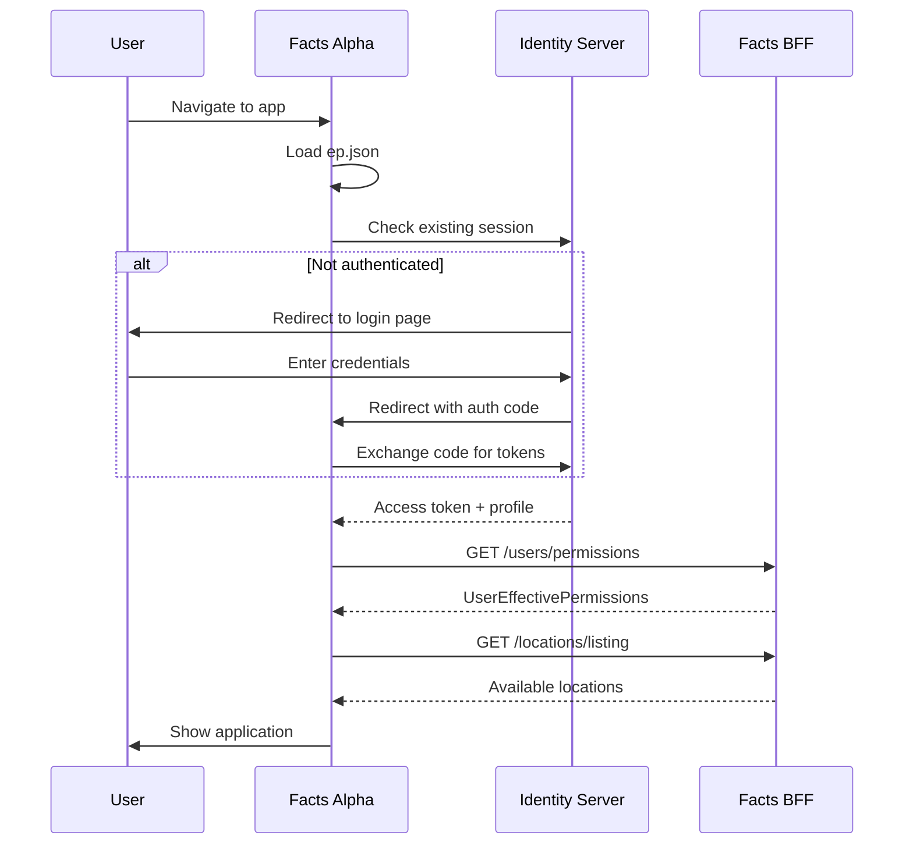

# Authentication & BFF Integration

This document describes the authentication system and backend integration for Facts Alpha.

## Overview

Facts Alpha uses **OIDC (OpenID Connect)** for authentication, matching the legacy Facts app implementation. The app communicates with the Facts BFF (Backend for Frontend) for all API calls.

## Architecture

```
┌─────────────────────────────────────────────────────────────┐
│                     Facts Alpha (Frontend)                   │
│  ┌─────────────┐  ┌─────────────┐  ┌─────────────┐         │
│  │  Vue Pages  │  │  Composables │  │  API Client │         │
│  └─────────────┘  └─────────────┘  └─────────────┘         │
└──────────────────────────┬──────────────────────────────────┘
                           │ HTTPS (Bearer Token + Tenant-Id)
                           ▼
┌─────────────────────────────────────────────────────────────┐
│                     Facts BFF Gateway                        │
│  ┌─────────────┐  ┌─────────────┐  ┌─────────────┐         │
│  │ Controllers │  │  Clients    │  │ Auth/Tenant │         │
│  └─────────────┘  └─────────────┘  └─────────────┘         │
└──────────────────────────┬──────────────────────────────────┘
                           │ Internal HTTP
                           ▼
┌─────────────────────────────────────────────────────────────┐
│                     Microservices                            │
│  ┌───────┐ ┌───────┐ ┌───────┐ ┌───────┐ ┌───────┐        │
│  │Locations│ │Contracts│ │Payments│ │ Trust │ │Workflow│    │
│  └───────┘ └───────┘ └───────┘ └───────┘ └───────┘        │
└─────────────────────────────────────────────────────────────┘
```

## Key Components

### 1. Endpoint Configuration (`ep.json`)

Runtime configuration file for environment-specific URLs:

**Location:** `apps/web/public/ep.json`

```json
{
  "bff": "https://cloud-dev-bff.factssquared.com",
  "ids": "https://cloud-dev-auth.factssquared.com",
  "signalr": "https://cloud-dev-signalr.factssquared.com",
  "reports": "https://cloud-dev-reports.factssquared.com/api"
}
```

**Benefits:**

- Switch environments without rebuilding
- Same pattern as legacy Facts app
- Loaded at app bootstrap

### 2. Authentication Service

**Location:** `apps/web/src/shared/lib/auth/authService.ts`

Uses `oidc-client-ts` library with configuration:

- **Client ID:** `factsapp2`
- **Response Type:** `code` (Authorization Code Flow with PKCE)
- **Scopes:** `openid profile Facts offline_access`

**Key Methods:**

- `initialize()` - Set up OIDC with Identity Server URL
- `login(returnUrl)` - Redirect to login
- `logout()` - Sign out
- `getUser()` - Get current user from token
- `getAccessToken()` - Get bearer token for API calls

### 3. HTTP Client with Interceptors

**Location:** `apps/web/src/shared/api/http/client.ts`

**Request Interceptor:**

```typescript
// Automatically adds headers to every request
Authorization: Bearer {token}
Tenant-Id: {tenantId}
```

**Response Interceptor:**

- Handles 401 errors (redirects to login)
- Global error handling

### 4. User Context Store

**Location:** `apps/web/src/stores/userContext.ts`

Central store for:

- Current user info (from OIDC profile)
- Tenant ID (from OIDC profile)
- User permissions (from BFF)
- Available locations
- Current location selection

**Key Method:**

```typescript
async initFromAuth() {
  // 1. Get user from OIDC
  // 2. Extract profile (name, email, tenant)
  // 3. Fetch permissions from BFF
  // 4. Load available locations
}
```

### 5. Router Guard

**Location:** `apps/web/src/app/providers/router.ts`

Enforces authentication and permissions:

1. Check if route allows anonymous access
2. Check authentication status (redirect to login if needed)
3. Initialize user context if not done
4. Validate route permissions

## Authentication Flow



## Development vs Production

### Development Mode (JSON Server)

- Uses mock data from `packages/mock-api`
- No real authentication required
- `initMockUser()` provides mock permissions
- Set `VITE_API_TYPE=json-server` (default)

### Production Mode (BFF)

- Real OIDC authentication required
- All API calls go through BFF with Bearer token
- Permissions loaded from backend
- Set `VITE_API_TYPE=bff` in environment

## Environment Variables

None required! Configuration is in `ep.json` for runtime flexibility.

Optional overrides via `import.meta.env`:

- `VITE_API_TYPE` - API mode: `json-server` (dev) or `bff` (prod)
- `VITE_API_BASE_URL` - Override API URL (if not using ep.json)

## Files Created/Modified

### New Files

| File                                          | Purpose                     |
| --------------------------------------------- | --------------------------- |
| `apps/web/public/ep.json`                     | Endpoint configuration      |
| `apps/web/public/callback.html`               | OIDC login callback handler |
| `apps/web/public/silent-renew.html`           | Token refresh handler       |
| `apps/web/src/shared/config/endpoints.ts`     | Endpoint provider service   |
| `apps/web/src/shared/lib/auth/authService.ts` | OIDC authentication         |
| `apps/web/src/shared/lib/auth/index.ts`       | Auth exports                |
| `apps/web/src/shared/api/usersApi.ts`         | User/permissions API        |

### Modified Files

| File                                                      | Changes                             |
| --------------------------------------------------------- | ----------------------------------- |
| `apps/web/src/shared/api/http/config.ts`                  | Added auth token integration        |
| `apps/web/src/shared/api/http/client.ts`                  | Added request/response interceptors |
| `apps/web/src/shared/api/sources/createHttpDataSource.ts` | Made getHttpClient async            |
| `apps/web/src/stores/userContext.ts`                      | Added tenant ID, `initFromAuth()`   |
| `apps/web/src/app/providers/router.ts`                    | Enforced authentication             |
| `apps/web/src/main.ts`                                    | Added bootstrap sequence            |

## Testing Authentication

### Test with Mock Data (Default)

```bash
pnpm dev
# App uses mock user and JSON Server
# No login required
```

### Test with Real BFF (Production-like)

1. Update `apps/web/public/ep.json` with dev/test endpoints
2. Set environment:
   ```bash
   export VITE_API_TYPE=bff
   pnpm dev
   ```
3. App will redirect to Identity Server login
4. After login, permissions loaded from BFF

### Test Permission Restrictions

In `apps/web/src/stores/userContext.ts`:

```typescript
function initMockUser() {
  userPermissions.value = {
    isAdmin: false, // Toggle this
    permissionsGranted: getMockPermissions(),
  }
}
```

## Troubleshooting

### "Failed to retrieve endpoint addresses"

- Check that `apps/web/public/ep.json` exists
- Verify JSON is valid
- Check browser network tab for 404

### "Unable to load configuration"

- Check console for specific error
- Verify ep.json URL structure is correct
- Check CORS if loading from different domain

### Login redirect loop

- Clear localStorage: `localStorage.clear()`
- Check Identity Server URL in ep.json
- Verify client ID matches backend config

### 401 Unauthorized on API calls

- Check that token is being sent (Network tab → Headers)
- Verify token hasn't expired
- Check Tenant-Id header is present

## Next Steps

- [ ] Add silent token renewal (automatic background refresh)
- [ ] Add SignalR integration for real-time updates
- [ ] Add activity session tracking (heartbeat)
- [ ] Add logout confirmation dialog
- [ ] Add session timeout warning

## Related Documentation

- [API Integration](./api-integration.md) - BFF endpoint patterns
- [Permissions](./permissions.md) - Permission system details
- [Development](./development.md) - Setup and commands
