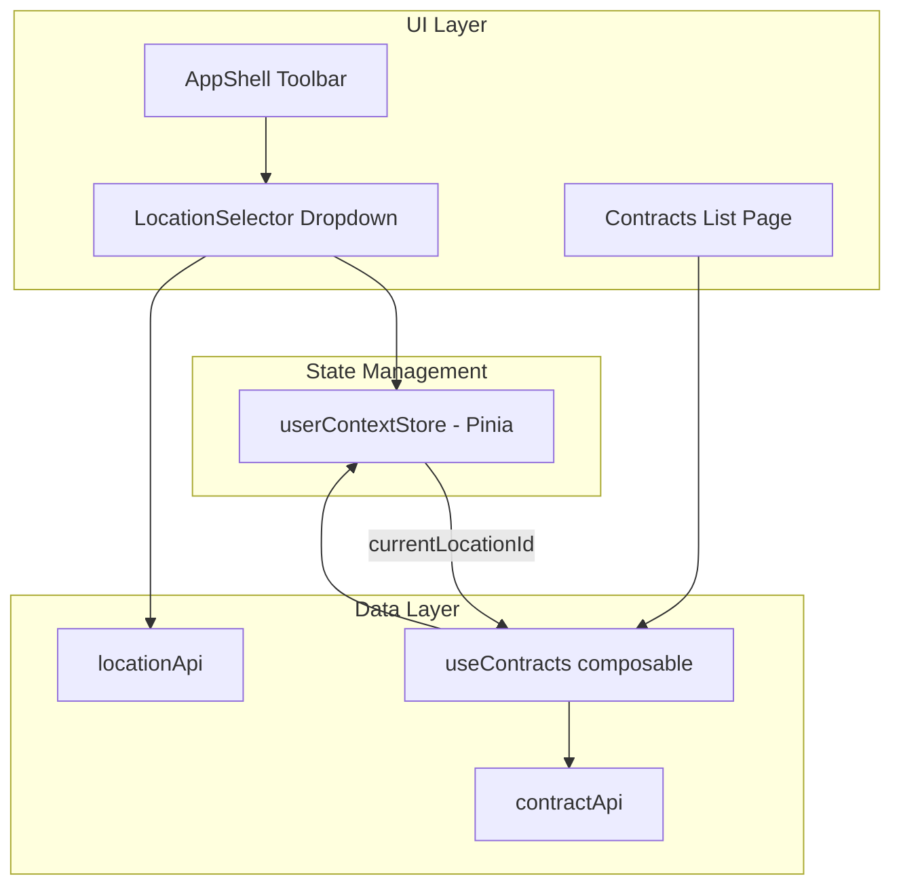

# Location Context and Filtering

The application supports **location-scoped data access** where users select a location from the toolbar, and all data (contracts, etc.) is automatically filtered to that location.

## Architecture



## Components

**LocationSelector** (`widgets/app-shell/ui/LocationSelector.vue`):

- Dropdown in AppShell toolbar showing current location
- Displays location name with type icon (funeral home, cemetery)
- Lists all selectable (non-corporate) locations
- Shows checkmark on currently selected location
- Calls `userContext.switchLocation()` on selection

**User Context Store** (`stores/userContext.ts`):

- Pinia store managing current user and location
- `loadLocations()` - Fetches locations from `locationApi.list()`
- `switchLocation(locationId)` - Changes current location
- `currentLocationId` - Computed property for reactive access
- `selectableLocations` - Filters out corporate locations

## Data Filtering

Contracts are automatically filtered by the current location:

```typescript
// entities/contract/model/useContracts.ts
export function useContracts() {
  const userContext = useUserContextStore()

  // Query key includes locationId for cache separation
  const queryKey = computed(() => ['contracts', userContext.currentLocationId] as const)

  // Filter by current location first
  const locationFilteredContracts = computed(() => {
    const locationId = userContext.currentLocationId
    if (!locationId) return []
    return contracts.value.filter((c) => c.locationId === locationId)
  })

  // ... rest of filtering chain uses locationFilteredContracts
}
```

## Contract-Location Relationship

All contracts must have a `locationId` field linking them to a location:

```typescript
// entities/contract/model/contract.ts
export interface Contract {
  // ... other fields
  locationId: string // Link to Location entity
}
```

When creating new contracts, the current location is automatically assigned:

```typescript
// features/contract-dialog/ui/ContractDialog.vue
const initialFormValues = computed(() => {
  if (session.isNewContract.value) {
    // New contracts get the current location from user context
    return getDefaultContractFormValues(userContext.currentLocationId ?? '')
  }
  // ... existing contract
})
```

## Initialization Flow

1. AppShell mounts and calls `userContext.loadLocations()`
2. Store fetches locations from `locationApi.list()`
3. First active, non-corporate location is auto-selected
4. LocationSelector displays current location in toolbar
5. All data queries (contracts, etc.) filter by `currentLocationId`

## Usage

```vue
<script setup>
  import { useUserContextStore } from '@/stores'

  const userContext = useUserContextStore()

  // Access current location
  const currentLocation = computed(() => userContext.currentLocation)
  const locationId = computed(() => userContext.currentLocationId)

  // Switch location
  userContext.switchLocation('loc-003')
</script>
```
