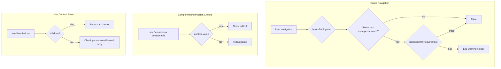

# Permissions & Route Guards

The application includes a permission system aligned with the legacy FACTS application, providing route-level and UI-level access control.

## Architecture



## Security Keys

Permission keys are numeric constants aligned with the legacy app:

```typescript
import { SecurityOptionKeys, PermissionLevel } from '@/shared/lib/security'

// Example keys
SecurityOptionKeys.ProcessContracts // 25
SecurityOptionKeys.ManageLocations // 40
SecurityOptionKeys.ProcessPayments // 29
```

## Permission Levels

- **Read** (`PermissionLevel.Read = 0`) - View-only access
- **Edit** (`PermissionLevel.Edit = 1`) - Full read/write access

Edit permission automatically includes Read access (checked with `>=` comparison).

## Route Protection

Routes define permission requirements using `definePage()`:

```typescript
// pages/contracts/index.vue
import { readRequirement, SecurityOptionKeys } from '@/shared/lib/security'

definePage({
  meta: {
    title: 'Contracts',
    permissions: readRequirement(SecurityOptionKeys.ProcessContracts),
  },
})
```

The router guard checks permissions before navigation:

```typescript
// app/providers/router.ts
router.beforeEach((to, _from) => {
  const userContext = useUserContextStore()

  // Check route meta.permissions
  if (to.meta.permissions) {
    if (!userContext.userCanWithRequirement(to.meta.permissions)) {
      // Log warning (development) or block (production)
      return { path: '/' }
    }
  }

  return true
})
```

## UI-Level Permission Checks

Use the `usePermissions` composable to gate UI elements:

```vue
<script setup>
  import { SecurityOptionKeys, usePermissions } from '@/shared/lib'

  // Check edit permission
  const { canEdit } = usePermissions({
    editKey: SecurityOptionKeys.ManageLocations,
  })
</script>

<template>
  <!-- Hide button if no edit permission -->
  <FButton
    v-if="canEdit"
    @click="handleEdit"
  >
    Edit Location
  </FButton>

  <!-- Disable edit on list -->
  <FListCard
    :edit-enabled="canEdit"
    @edit="showEdit"
  />
</template>
```

## User Context Store

The `useUserContextStore` provides permission checking methods:

```typescript
import { useUserContextStore } from '@/stores'
import { SecurityOptionKeys, PermissionLevel } from '@/shared/lib/security'

const userContext = useUserContextStore()

// Check specific permission
const canEditContracts = userContext.userCanWithKey(
  SecurityOptionKeys.ProcessContracts,
  PermissionLevel.Edit,
)

// Check requirement object
const canView = userContext.userCanWithRequirement(
  readRequirement(SecurityOptionKeys.ManageLocations),
)

// Check multiple (user needs at least one)
const canAccess = userContext.userCanWithAnyRequirement([
  readRequirement(SecurityOptionKeys.ProcessContracts),
  readRequirement(SecurityOptionKeys.ProcessPayments),
])

// Check location access
const canAccessLocation = userContext.userCanAccessLocation('loc-001')
```

## Mock Permissions (Development)

For development, mock permissions are initialized in `userContext.initMockUser()`:

```typescript
// stores/userContext.ts
userPermissions.value = {
  isAdmin: false, // Set to true to bypass all checks
  permissionsGranted: [
    { key: SecurityOptionKeys.ProcessContracts, level: PermissionLevel.Edit },
    { key: SecurityOptionKeys.ManageLocations, level: PermissionLevel.Read },
    // ... more permissions
  ],
}
```

**To test permission restrictions:**

1. Set `isAdmin: false` in `initMockUser()`
2. Remove or downgrade permissions in `getMockPermissions()`
3. Navigate to protected routes - console warnings will show
4. UI elements will hide/disable based on permissions

## Permission Helpers

```typescript
import {
  readRequirement,
  editRequirement,
  readRequirements,
  editRequirements,
} from '@/shared/lib/security'

// Single requirement
const req = readRequirement(SecurityOptionKeys.ProcessContracts)

// Multiple requirements
const reqs = readRequirements([
  SecurityOptionKeys.ProcessContracts,
  SecurityOptionKeys.ProcessPayments,
])
```

## Location-Based Permissions

When switching locations, permissions are re-evaluated. The system supports:

- **Location-scoped permissions** - User may have different permissions per location
- **Location type filtering** - Routes can filter by location type (funeral/cemetery/corporate)
- **Location access validation** - `userCanAccessLocation()` checks if user can access a specific location

## Integration with Legacy App

The permission system is designed to align with the legacy FACTS application:

- Same security option keys (numeric constants)
- Same permission levels (Read/Edit)
- Same validation logic (`SecurityValidator` pattern)
- Compatible permission data structure from backend

When integrating with the real backend, the `UserEffectivePermissions` type matches the legacy API response format.
